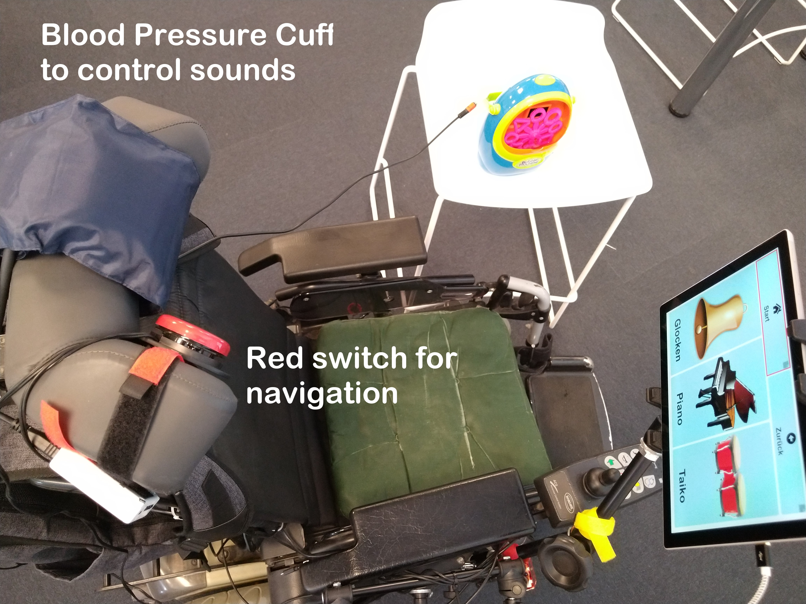

# Results of Project Kissenschalter

Project results of UNIKATE project kissenschalter (see [UNIKATE Ideenwettbewerb 2021](https://www.behindertenrat.at/2021/12/unikate-ideenwettbewerb-2021/)). A blood pressure cuff was used as an analog input to control and create sounds. Additionally it can be used as input switch to emulate mouse functions or keyboards functions or navigate the user interface. In this repository the used equipment is described and the configuration settings are provided. 

## Demo Videos

* [Demo of Kissenklang](https://youtu.be/5d4WYjJhgug)
* [Demo of controlling toy robot](https://youtu.be/9z9Q-3h2CdI)
* [Demo of controlling soap bubble machine](https://youtu.be/aatYWlpXNeQ)
* [Demo of controlling disco lights](https://youtu.be/Mp3Usqg8MDo)

## User Documentation

Please have a look at the
* [User Handbook](./solution-final/doc/Benutzerhandbuch-UNIKATE-Projekt-Kissenschalter.pdf)
* [Presentation Slides](./solution-final/doc/Projekt%20Kissenschalter-UNIKATEWS2020-20210916.pdf)
* [Equipment List](./solution-final/doc/UNIKATE_Equipment_Liste.pdf)

## Project files

The project files used can be found in the subfolder [solution-final](solution-final/)

## FABI Modifications

As input device the Flexible Assistive Button Interface (FABI) was used. It has many input ports for Assistive Switches and an air pressure sensor which was connected with the blood pressure cuff.
In order to [switch the soap bubble machine](https://youtu.be/aatYWlpXNeQ) and other battery-powerd toys the FABI was modified with a transistor. Have a look at the [FABI repository](https://github.com/asterics/FABI/tree/deinhofer/switching-output-port#fabi-switching-output-port-branch) for a detailed description.
